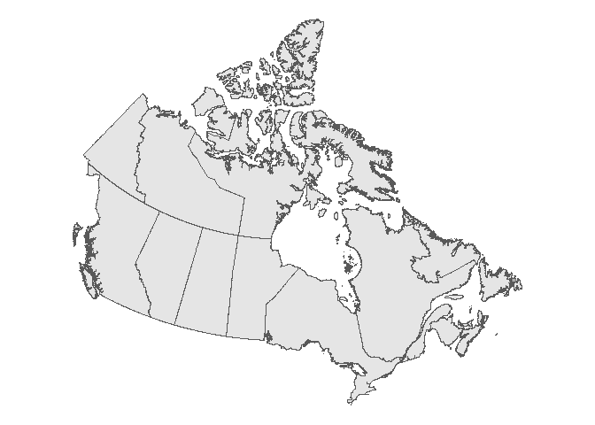
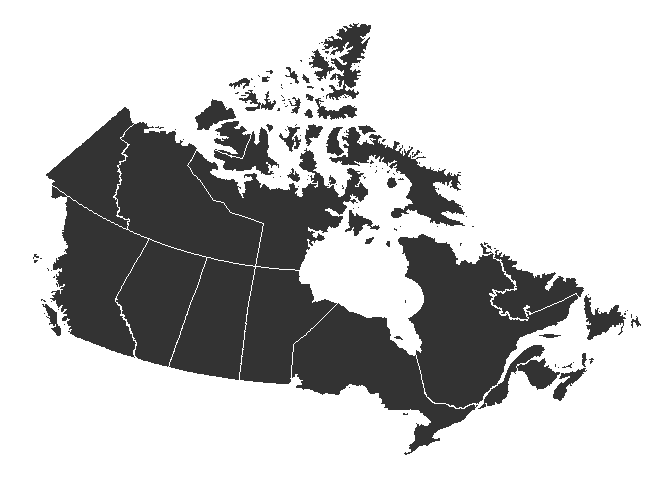

<!-- README.md is generated from README.Rmd. Please edit that file -->

# Files for plotting maps of Canada

This repository contains **simplified** GeoJSON and shapefiles for
plotting maps of Canada. The original shapefiles were obtained from

- [Statistics Canada 2016 Census provincial/teritorial - Boundary
  files](https://www12.statcan.gc.ca/census-recensement/2011/geo/bound-limit/bound-limit-2016-eng.cfm)

- [Statistics Canada 2021 Census forward sortation areas (FSA) -
  Boundary
  files](https://www12.statcan.gc.ca/census-recensement/alternative_alternatif.cfm?l=eng&dispext=zip&teng=lfsa000b21a_e.zip&k=%20%20%20158240&loc=//www12.statcan.gc.ca/census-recensement/2021/geo/sip-pis/boundary-limites/files-fichiers/lfsa000b21a_e.zip)

which are saved in the [`statcan_files/`](statcan_files/) directory.
**Large files are not included in this repository. Download if any files
are not uploaded.**

The purpose of this repository is to provide simplified map files, as
the original files can be large and takes time to plot. **The
simplifying process can remove fine details in the boundaries,
especially along small geographies**.

## What to download

The converted files are available in the
[`exported_files`](exported_files/) directory as  
- GeoJSON files obtained from directly converting shapefiles
([`province_territory.geojson`](exported_files/province_territory.geojson),
[`forward_sortation_areas.geojson`](exported_files/forward_sortation_areas.geojson)),  
- GeoJSON files of the simplified boundaries
([`province_territory_simplified.geojson`](exported_files/province_territory_simplified.geojson),
[`forward_sortation_areas_simplified.geojson`](exported_files/forward_sortation_areas_simplified.geojson)),  
- shapefiles of the simplified boundaries
([`province_territory_simplified_sp`](exported_files/province_territory_simplified_sp/),
[`forward_sortation_areas_simplified_sp`](exported_files/forward_sortation_areas_simplified_sp/)).

## Example: How to plot in `R`

These are plotted using the [`ggplot2`](https://ggplot2.tidyverse.org/)
package. See \[1\] and \[2\] for code to plot using base plotting
functions.

``` r
library(ggplot2)
```

### From original shapefiles

``` r
province_territory_map_original_sp <- sf::read_sf(
  dsn = here::here("statcan_files", "province_territory_map"), 
  layer = "lpr_000b16a_e"
)

p_original <- ggplot(
  data = province_territory_map_original_sp
) + 
  geom_sf() + 
  theme_void()

system.time(
  plot(p_original)  
)
```



    ##    user  system elapsed 
    ##    2.21    4.14    7.78

### From simplified shapefiles

``` r
province_territory_map_sim_sp <- sf::read_sf(
  dsn = here::here("exported_files", "province_territory_simplified_sp"), 
  layer = "province_territory_simplified_sp"
)

p_sim_sp <- ggplot(
  data = province_territory_map_sim_sp
) + 
  geom_sf() + 
  theme_void()

system.time(
  plot(p_sim_sp)
)
```



    ##    user  system elapsed 
    ##    0.20    0.30    0.63

### From simplified GeoJSON files

``` r
province_territory_map_sim_json <- geojsonio::geojson_read(
  x = here::here("exported_files", "province_territory_simplified.geojson"),
  what = "sp"
)
```

    ## Registered S3 method overwritten by 'geojsonsf':
    ##   method        from   
    ##   print.geojson geojson

``` r
p_sim_json <- ggplot(
  data = province_territory_map_sim_json,
  mapping = aes(x = long, y = lat, group = group)
) + 
  geom_polygon(
    colour = "white"
  ) + 
  theme_void()
```

    ## Warning: `fortify(<SpatialPolygonsDataFrame>)` was deprecated in ggplot2 3.4.4.
    ## ℹ Please migrate to sf.
    ## ℹ The deprecated feature was likely used in the ggplot2 package.
    ##   Please report the issue at <https://github.com/tidyverse/ggplot2/issues>.
    ## This warning is displayed once every 8 hours.
    ## Call `lifecycle::last_lifecycle_warnings()` to see where this warning was
    ## generated.

    ## Regions defined for each Polygons

``` r
system.time(
  plot(p_sim_json)
)
```


    ##    user  system elapsed 
    ##    0.06    0.28    0.46

## Additional notes

The R code used to generate simplified boundary files are available at
[`r_src/generate_geojson.r`](r_src/generate_geojson.r).

## References

\[1\]
<https://www.r-graph-gallery.com/168-load-a-shape-file-into-r.html>  
\[2\]
<https://www.r-graph-gallery.com/325-background-map-from-geojson-format-in-r.html>
